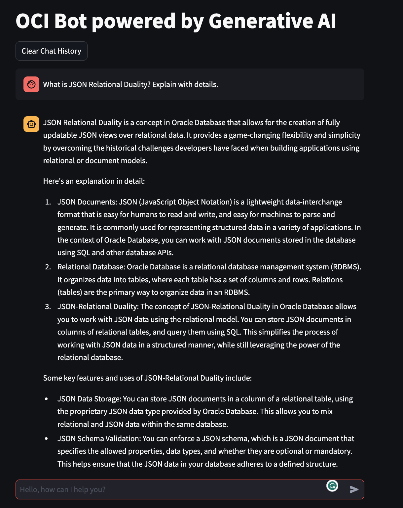

# Integrate Oracle Vector DB and OCI GenAI with Llama-index and LangChain

This repository contains all the work done on the development of RAG applications using:
* Oracle Vector DB
* Oracle OCI GenAI Service
* Oracle OCI Embeddings
* Cohere Reranking
* Reranker deployed in OCI Data Science
* OCI [ADS 2.10.0](https://accelerated-data-science.readthedocs.io/en/latest/user_guide/large_language_model/langchain_models.html) (with support for OCI GenAI)
* llama-index
* LangChain

## What is RAG?
A very good introduction to what **Retrieval Augmented Generation** (RAG) is can be found [here](https://www.oracle.com/artificial-intelligence/generative-ai/retrieval-augmented-generation-rag/)

## Features
* basic (12/2023) integration between **Oracle DB Vector Store (23c)** and **llama-index**
* All documents stored in an Oracle DB
* Oracle DB used for semantic search
* Reranking to improve retrieval
* How to show references (documents used for the response generation)
* (30/12) Added reranker implemented as OCI Model Deployment
* (20/01) Added implementation of Vector Store for LangChain and demo

## Demos
* [demo1](./custom_vector_store_demo1.ipynb) This NB shows a demo where you get answers to questions on Oracle Database and new features in 23c
* [Bot](./oracle_bot.py) powered by **Oracle Vector DB** and **OCI GenAI**
* [demo3](./custom_vector_store_demo3.ipynb) shows how to add a Reranker to the RAG chain; I have used **Cohere**
* [demo5](./rag_chain_demo5.ipynb) shows a full rag chain where the reranker is deployed on OCI DS
* [LangChain](./demo_langchain2.ipynb) demo based on Oracle Vector DB and LangChain

## Setup
See the wiki pages.

## Loading data
* You can use [create_save_embeddings](./create_save_embeddings.py) to load all the data in the Oracle DB schema.
* You can launch it using the script [load_books](./load_books.sh).
* The list of files to be loaded is specified in the file config.py

You need to have pdf files in the same directory.

## Limited Availability
* (News) **OCI GenAI is General Availability** since 23/01/2024, see updated docs for setup

Oracle **AI Vector Search** (Vector DB) is a new feature in Oracle DB 23c, in **Limited Availability**. 

Customers can easily enter in the LA programs.

To test these functionalities you need to enrol in the LA programs and install the proper versions of software libraries.

Code and functionalities can change, as a result of the feedbacks from customers.

## Releases used for the demo (WIP)
* OCI 2.119.1
* OCI ADS 2.10.0
* LangChain >= 0.1.4
* LangChain Community >= 0.0.16
* Llama-index >= 0.9.37.post1
* Oracle Database 23c (23.4) free edition with Vector DB

## Libraries
* OCI Python SDK
* OCI ADS
* Streamlit
* Llama-index
* LangChain

## prepare_chain and factory methods
In the module prepare_chain are defined factory methods to create: embedder, llm, reranker...

The philosophy is to make things simpler. So all the configuration are taken from config.py.

If you want to change the llm, (or anything else) go to config.py. No params in the NBs
